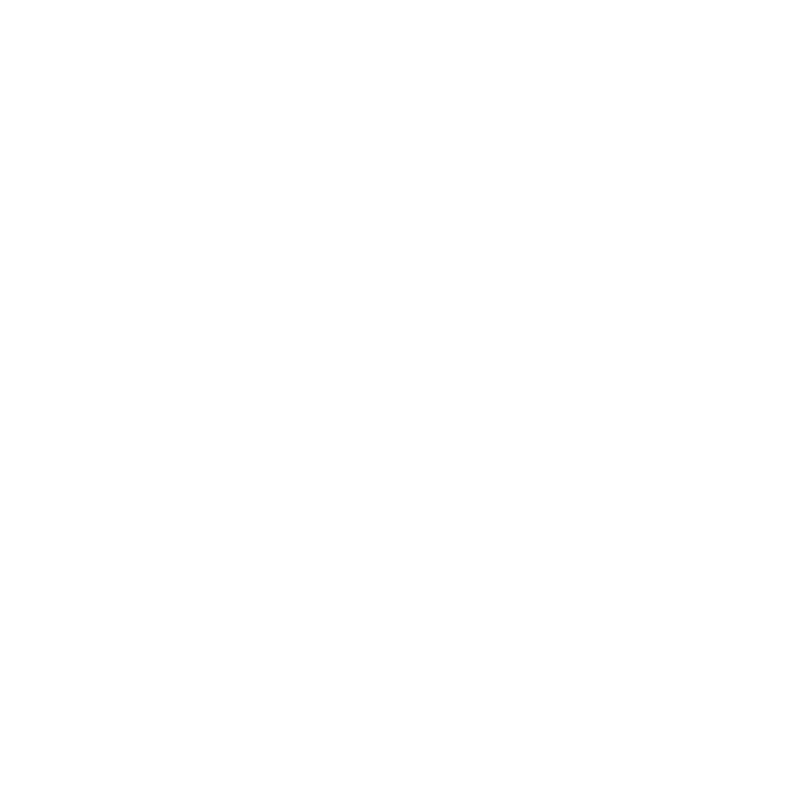

# Andrii Vynohradov — Personal Portfolio

[](package.json)
[](package.json)
[](package.json)
[](package.json)
[](https://buymeacoffee.com/resonaura)

Interactive personal portfolio website featuring custom GLSL fluid shader effects, magnetic cursor physics, smooth presentation slides, and showcase of selected engineering and audio software projects.

---

## ✨ Highlights

- 🌊 **Real-Time WebGL Shader**: Interactive water ripple and distortion effect powered by Three.js and custom GLSL uniforms.
- 🎯 **Fluid Cursor Physics**: Custom iPadOS-style magnetic cursor with dynamic boundary snaps and physics.
- 📜 **Presentation Slides Layout**: Responsive slide sections with scroll-driven offset transitions.
- 🎨 **Minimal Modern Aesthetic**: Dark-themed typographic design with Scss modules and fluid layouts.

---

## 🛠️ Tech Stack

- **Framework**: React 18 & TypeScript
- **Build Tool**: Vite (SWC)
- **Styling**: SCSS, CSS Variables, Bootstrap Icons
- **Graphics**: Three.js, Shader-Art, custom GLSL vertex/fragment shaders

---

## 🚀 Getting Started

```bash
# Install dependencies
npm install

# Start development server
npm run dev

# Build for production
npm run build

# Preview production build
npm run preview
```
